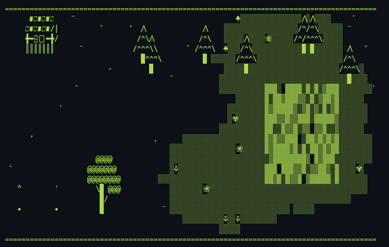

# Project Autofarm



## About

A C# console-based farming simulation featuring procedural terrain generation, crops, resources, and (later) autonomous NPCs.

## Features

* Procedurally generated terrain with trees, foliage, and miscellaneous objects
* 2D tile-based world
* Character-based texture system loaded from external data
* Console-based rendering

## Technologies

* C#
* .NET
* `.sc` files for texture I/O
* Console Application

## Project Structure

As I am writing everything from scratch without any blueprints, structural changes may happen, but the overall foundations are already working without major flaws.

### ProjectAutofarm/

* `ProjectAutofarm.csproj`
* `Program.cs`
* `Renderer.cs`
* `MainLoop.cs`
* `Resources.cs`
* `Structures.cs`
* `Interfaces.cs`
* `Position.cs`
* `Terrain.cs`
* `Tiles.cs`
* `Textures.cs`

### Resources/

* `Textures.sc`

## How It Works

### Terrain

A 2D array grid with tiles is created at startup in a 16:9 ratio.

Each tile contains information such as its texture name, icon, position, and potential resources such as wheat.

There are whole patterns of grassland that are created with "controlled randomness" and use additional noise to make them look more organic.

Foliage and smaller objects are randomly created at the bottom, logically depending on the texture.

### Textures

The textures are made of retro but charming ASCII / Unicode characters.

The texture I/O is what makes me most happy so far, as it works flawlessly and intuitively.

An `.sc` file containing `texturename,charIcon` is deserialized into a dictionary.

Now comes the cool part: I only have to add the texture name (`Dictionary<TKey>`) and it automatically adds the icon to the texture.

It was an experiment for me and works flawlessly!

### Rendering

Two nested `for` loops `(x, y)` write the whole terrain into a `StringBuilder` to offer better performance and visual quality than printing every character individually.

Each round, a freshly updated output is displayed as a complete frame.

## What I Learned

This project has already helped me a lot so far to strengthen my C# knowledge, but the things I would like to point out are:

* Intuitive file I/O for textures
* Procedural generation with noise effects / working with multiple parameters
* Console rendering

## Future Plans

* Even more sophisticated terrain generation / simulation
* NPCs are next on the list!
* Player movement
* Farming / foraging mechanics

## Getting Started

### Requirements

* .NET 10 SDK

### Run

```bash
git clone https://github.com/RobertHaake89/project-autofarm.git
cd project-autofarm
dotnet run
```

## License

This project is licensed under the MIT License.

## Progress

* **10-09-26** — Initial commit
* **11-09-26** — Added classes, world generation WIP
* **12-09-26** — Refactored texture class; problems with the dictionary's `char`/`string` mechanism and changing textures
* **14-09-26** — Continued with primitive terrain generation with fields; noise generator WIP
* **15-09-26** — Several problems with grass pattern formation and noise creation
* **16-09-26** — Finished primitive terrain generation; added random objects (flowers, stones, etc.) ... and a farmhouse!
* **17-09-26** — Finished farm mechanic with independently growing crops
* **18-09-26** — Added random pine trees and mushrooms at the top and an oak at the bottom
* **19-09-26** — Finally fixed flickering (sneaky `WriteLine` — only using `\n` within nested render loops caused the flicker jumps)! General cleanup; turned growth factor into a switch expression. Added proper `README.md` with image.
